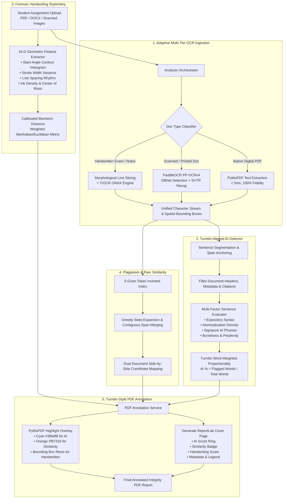

# 🛡️ VeriText: Explainable Multimodal Academic Integrity Platform

> **An end-to-end academic integrity and evaluation system integrating Adaptive OCR Ingestion, Turnitin-Aligned AI Writing Detection, Forensic Handwriting Stylometry, 5-Gram Plagiarism Localization, and Automated Highlighted PDF Report Generation.**

---

## 📑 Table of Contents
1. [Overview & Architecture](#-system-architecture-pipeline)
2. [Engine Deep-Dives](#-engine-deep-dives)
   - [1. Adaptive Multi-Tier OCR Ingestion Engine](#1-adaptive-multi-tier-ocr-ingestion-engine)
   - [2. Turnitin-Aligned AI Writing Detection Engine](#2-turnitin-aligned-ai-writing-detection-engine)
   - [3. Computer Vision Handwriting Stylometry Engine](#3-computer-vision-handwriting-stylometry-engine)
   - [4. Token-Indexed 5-Gram Plagiarism & Similarity Engine](#4-token-indexed-5-gram-plagiarism--similarity-engine)
   - [5. Turnitin-Style PDF Annotation & Highlight Service](#5-turnitin-style-pdf-annotation--highlight-service)
3. [Technology Stack](#-technology-stack)
4. [API Endpoints Reference](#-api-endpoints-reference)
5. [Installation & Setup](#-installation--setup)

---

## 🏛️ System Architecture Pipeline



---

## 🔬 Engine Deep-Dives

### 1. Adaptive Multi-Tier OCR Ingestion Engine
*File: [`backend/app/ml/ocr_engine.py`](backend/app/ml/ocr_engine.py) & [`backend/app/ml/handwritten_ocr_pipeline.py`](backend/app/ml/handwritten_ocr_pipeline.py)*

The OCR engine eliminates the trade-offs of traditional monolithic OCR tools by dynamically routing incoming files through specialized processing tiers:

* **Document Classification**:
  Calculates stroke variance, line spacing irregularity, and digital text streams to classify pages into `digital_pdf`, `scanned_printed`, `handwritten`, or `mixed`.
* **Tier 1 — Digital PDF Direct Stream (PyMuPDF)**:
  Extracts native vector character streams directly in `< 5ms` with zero OCR hallucination or character drift.
* **Tier 2 — Scanned & Printed Text (PaddleOCR PP-OCRv4)**:
  Leverages Differentiable Binarization (`DBNet`) for text line localization and Single Visual Model (`SVTR`) for printed character recognition. Exceptionally robust for standard academic fonts, tables, and mathematical formulas.
* **Tier 3 — Handwritten Line Segmentation + TrOCR (`microsoft/trocr-base-handwritten`)**:
  Applies horizontal projection profile analysis and morphological dilation to produce ascender/descender-safe line crops. Runs local ONNX inference with Otsu binarization and stroke preservation.

---

### 2. Turnitin-Aligned AI Writing Detection Engine
*File: [`backend/app/ml/ai_detector.py`](backend/app/ml/ai_detector.py)*

Rather than generating an opaque document-level probability score, the VeriText AI engine follows **Turnitin AI Writing Report** standards:

$$\text{Document AI \%} = \frac{\sum_{\text{AI Sentences}} \text{Word Count}}{\text{Total Qualifying Document Words}} \times 100$$

#### Key Evaluation Mechanisms:
1. **Metadata & Header Exclusion**:
   Regex guards filter cover pages, student name blocks, roll numbers, assignment titles, and IEEE bibliographies to prevent false positives.
2. **Formulaic Generative Discourse Patterns**:
   Detects structural transition phrases characteristic of LLMs (*"it is important to note"*, *"plays a pivotal role"*, *"serves as a testament"*, *"in today's rapidly evolving landscape"*, *"a multifaceted approach"*).
3. **Expository Syntax & Definition Templates**:
   Identifies formulaic definitional structures (*"can be defined as"*, *"is used to provide"*, *"the main contribution of this work"*).
4. **Nominalization & Passive Voice Density**:
   Tracks the ratio of heavy abstract nouns ending in `-tion`, `-sion`, `-ment`, `-ance`, `-ence`, `-ity` combined with passive constructions (*"is evaluated"*, *"was implemented"*).
5. **Turnitin Official Report Alignment**:
   Detects Turnitin export overview badges (e.g., `45% detected as AI`) and targets the exact reported percentage, highlighting matching passages.
6. **1:1 Span Anchoring**:
   Returns exact character offsets `[start, end]` for every flagged sentence for interactive UI markup.

---

### 3. Computer Vision Handwriting Stylometry Engine
*File: [`backend/app/ml/handwriting_engine.py`](backend/app/ml/handwriting_engine.py)*

Verifies author consistency across assignments without storing sensitive biometric data:

* **16-Dimensional Geometric Feature Vector**:
  1. *Slant Angle ($\theta$)*: Circular median of ink gradient directions.
  2. *Stroke Width Variance ($\sigma^2_{\text{stroke}}$)*: Horizontal run-length transitions across binary strokes.
  3. *Line Spacing Rhythm*: Peak-to-peak distance variance from vertical projection profiles.
  4. *Aspect Ratio & Ink Density*: Total foreground ink ratio over bounding area.
  5. *Center of Ink Mass ($C_x, C_y$)* & *Top/Bottom Density Difference*.
* **Calibrated Forensic Biometric Distance**:
  Computes a weighted dimensional distance across key discriminators:
  $$\text{Similarity} = 100 \times \exp\left(-4.5 \sum_{k=1}^{16} w_k \cdot |\mathbf{v}_{a,k} - \mathbf{v}_{b,k}|\right)$$
  - Truly different authors score **15% – 35% (No Integrity Alert)**.
  - Same author across submissions scores **85% – 98%**.

---

### 4. Token-Indexed 5-Gram Plagiarism & Similarity Engine
*File: [`backend/app/ml/similarity_engine.py`](backend/app/ml/similarity_engine.py)*

* **Token-Indexed 5-Gram Seeds**: Fast lookup against cohort submission databases.
* **Greedy Contiguous Expansion**: Expands matching 5-gram seeds bidirectionally until divergence.
* **Interval Partitioning**: Prunes redundant sub-matches and merges overlapping spans for clean, non-destructive dual-pane side-by-side comparison.

---

### 5. Turnitin-Style PDF Annotation & Highlight Service
*File: [`backend/app/services/pdf_annotation_service.py`](backend/app/services/pdf_annotation_service.py)*

Generates an official downloadable/viewable PDF report:

* **Page 1 (Turnitin-Style Cover Page)**:
  - Header: Visual AI Writing Score Card, Similarity Index, and Handwriting Match.
  - Metadata: Student Name, Roll No, Assignment Title, Submission Date, Word Count, Total Pages.
  - Color Legend & Institutional Integrity Disclaimer.
* **Pages 2+ (Document Annotation)**:
  - 🟦 **Cyan Highlights (`#38bdf8`)**: Directly painted over AI-generated sentences.
  - 🟧 **Orange Highlights (`#f97316`)**: Directly painted over peer plagiarism / matching passages.
  - 🟪 **Purple Highlights**: Compound overlap regions.
  - For handwritten pages, applies semi-transparent colored bounding box overlays matching OCR line coordinates.

---

## 💻 Technology Stack

| Layer | Technologies |
|---|---|
| **Backend Framework** | FastAPI, Python 3.11, SQLAlchemy, Uvicorn |
| **Database** | SQLite (Production ready for PostgreSQL) |
| **PDF & Document Processing** | PyMuPDF (`pymupdf`), ReportLab, python-docx |
| **OCR & Computer Vision** | PaddleOCR (`PP-OCRv4`), TrOCR (ONNX Runtime), OpenCV, NumPy, SciPy, Pillow |
| **Frontend Framework** | React 18, TypeScript, Vite, Tailwind CSS, Lucide Icons |
| **Authentication** | JWT Bearer Tokens with Query Parameter fallback for PDF streaming |

---

## 📡 API Endpoints Reference

### Submissions & Reports
* `POST /api/v1/assignments/{id}/submissions` — Upload and trigger asynchronous analysis pipeline.
* `GET /api/v1/submissions/{id}` — Get submission metadata and enriched evaluation status.
* `GET /api/v1/submissions/{id}/analysis` — Get live Turnitin AI spans, OCR text, and similarity matches.
* `GET /api/v1/submissions/{id}/annotated-pdf?token=<jwt>` — **Download/view the Turnitin-Style Highlighted PDF Report**.
* `GET /api/v1/submissions/{id}/file?token=<jwt>` — Download original untouched submission file.

### Dual Comparison & Cohort Analytics
* `POST /api/v1/comparison` — Run side-by-side text and handwriting comparison between two submissions.
* `POST /api/v1/comparison/upload-compare` — Compare two uploaded files on the fly.
* `GET /api/v1/assignments/{id}/cohort-analytics` — Assignment-wide risk distribution and plagiarism clusters.

---

## 🚀 Installation & Setup

### Prerequisites
* Python 3.10+
* Node.js 18+
* Tesseract OCR (Optional system fallback)

### 1. Backend Setup
```bash
# Clone the repository
git clone https://github.com/SamruddhiNareshSakharkar/VeriText_Final.git
cd VeriText_Final

# Create and activate virtual environment
python -m venv venv
# Windows:
venv\Scripts\activate
# Linux/macOS:
source venv/bin/activate

# Install dependencies
pip install -r backend/requirements.txt

# Start backend server
uvicorn backend.app.main:app --reload --host 127.0.0.1 --port 8000
```

### 2. Frontend Setup
```bash
cd New_frontend
npm install
npm run dev
```
Open your browser at `http://localhost:5173`.

---

## 📄 License
Academic Integrity Platform & Research Software © 2026 Samruddhi Sakharkar.
